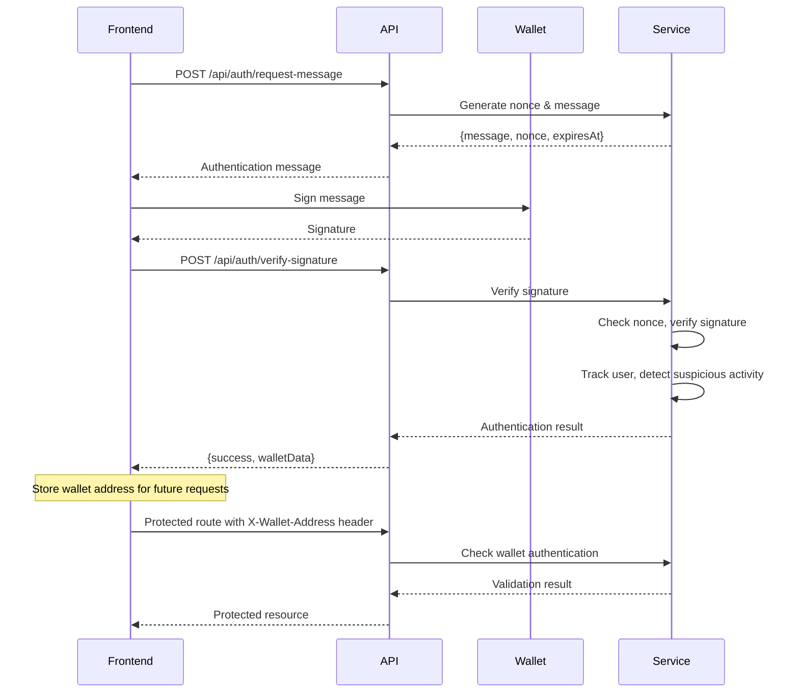

# Wallet Authentication System

## 🎉 Implementation Complete!

This document describes the **newly implemented** wallet authentication system for DensoFi. The system allows users to authenticate using their Web3 wallets by signing messages, providing secure, gas-free authentication.

## ✅ What's Been Implemented

### 1. **Core Service** (`src/services/wallet-auth-service.ts`)
- Message generation with nonces
- Signature verification using viem
- User tracking (IP addresses, sign-in counts, timestamps)
- Suspicious activity detection
- Statistical analytics

### 2. **Authentication Middleware** (`src/middleware/wallet-auth.ts`)
- `requireWalletAuth`: Enforces wallet authentication
- `optionalWalletAuth`: Adds auth info when available
- `checkSuspiciousWallet`: Monitors for suspicious activity

### 3. **API Endpoints** (added to `src/api/domain-routes.ts`)

#### Public Endpoints
- `POST /api/auth/request-message` - Get message to sign
- `POST /api/auth/verify-signature` - Verify wallet signature
- `GET /api/auth/wallet/:address` - Get wallet info
- `GET /api/auth/ip/:ip/wallets` - Get wallets for IP
- `GET /api/auth/stats` - Get auth statistics

#### Admin Endpoints (require API key)
- `GET /api/admin/wallet-auth-stats` - Detailed analytics
- `GET /api/admin/wallets` - Paginated wallet list
- `GET /api/admin/wallets/:address` - Detailed wallet info

### 4. **Testing & Examples**
- `scripts/test-wallet-auth.js` - Comprehensive test suite
- `examples/wallet-auth-example.ts` - Real wallet integration example
- React hook example for frontend integration

## 🚀 Getting Started

### 1. Set Up Environment

Add to your `.env` file:
```bash
ADMIN_API_KEY=your-secure-admin-key-here
```

### 2. Start Your Server

```bash
cd backend
npm run dev
```

### 3. Test the System

Run the test suite:
```bash
# Basic test with mock signatures
node scripts/test-wallet-auth.js

# Set your admin API key for admin endpoint testing
ADMIN_API_KEY=your-key node scripts/test-wallet-auth.js
```

### 4. Real Wallet Testing

```bash
# Run real wallet example (requires viem setup)
npx tsx examples/wallet-auth-example.ts
```

## 📝 Authentication Flow



## 🔧 Frontend Integration

### React Hook (wagmi)

```tsx
import { useSignMessage, useAccount } from 'wagmi';
import { useState } from 'react';

export function useWalletAuth() {
  const { address } = useAccount();
  const { signMessageAsync } = useSignMessage();
  const [isAuthenticated, setIsAuthenticated] = useState(false);

  const authenticate = async () => {
    if (!address) throw new Error('Wallet not connected');

    // 1. Request message
    const messageResponse = await fetch('/api/auth/request-message', {
      method: 'POST'
    });
    const { data } = await messageResponse.json();

    // 2. Sign message
    const signature = await signMessageAsync({
      message: data.data.message
    });

    // 3. Verify signature
    const verifyResponse = await fetch('/api/auth/verify-signature', {
      method: 'POST',
      headers: { 'Content-Type': 'application/json' },
      body: JSON.stringify({
        nonce: data.data.nonce,
        signature,
        walletAddress: address
      })
    });

    const result = await verifyResponse.json();
    if (result.success) {
      setIsAuthenticated(true);
      localStorage.setItem('authenticatedWallet', address);
      return result.data;
    }
    throw new Error(result.error);
  };

  const makeAuthenticatedRequest = async (endpoint: string, options: any = {}) => {
    const wallet = localStorage.getItem('authenticatedWallet');
    if (!wallet) throw new Error('Not authenticated');

    return fetch(endpoint, {
      ...options,
      headers: {
        ...options.headers,
        'X-Wallet-Address': wallet
      }
    });
  };

  return { authenticate, makeAuthenticatedRequest, isAuthenticated };
}
```

### Usage Example

```tsx
function AuthButton() {
  const { authenticate, isAuthenticated } = useWalletAuth();

  const handleAuth = async () => {
    try {
      const result = await authenticate();
      console.log('Authenticated!', result);
    } catch (error) {
      console.error('Auth failed:', error);
    }
  };

  return (
    <button onClick={handleAuth}>
      {isAuthenticated ? 'Authenticated ✅' : 'Sign In with Wallet'}
    </button>
  );
}
```

## 🔒 Protected Routes

### Protecting Backend Routes

```typescript
import { requireWalletAuth } from '../middleware/wallet-auth.js';

// Require wallet authentication
router.get('/protected-route', requireWalletAuth, (req: WalletAuthenticatedRequest, res) => {
  const wallet = req.wallet!; // Guaranteed to exist
  res.json({
    success: true,
    message: `Hello ${wallet.walletAddress}!`,
    signInCount: wallet.signInCount
  });
});
```

### Frontend Authenticated Requests

```typescript
const { makeAuthenticatedRequest } = useWalletAuth();

// Make authenticated API calls
const response = await makeAuthenticatedRequest('/api/protected-route');
const data = await response.json();
```

## 🛡️ Security Features

### Suspicious Activity Detection

The system automatically flags:
- **Multi-IP Usage**: Wallet used from >5 IP addresses
- **Multi-Wallet IPs**: IP associated with >10 wallets
- **Rapid Sign-ins**: Multiple sign-ins within 60 seconds

### Session Management
- **Nonce Expiration**: Messages expire after 10 minutes
- **Single Use**: Each nonce can only be used once
- **24-Hour Sessions**: Authentication valid for 24 hours

### Rate Limiting Protection
- Built-in protection against spam requests
- Automatic cleanup of expired sessions
- Suspicious activity logging

## 📊 Admin Dashboard

### Get Authentication Statistics

```bash
curl -H "Authorization: Bearer your-admin-key" \
     http://localhost:3000/api/admin/wallet-auth-stats
```

**Response:**
```json
{
  "success": true,
  "data": {
    "totalWallets": 150,
    "activeWallets24h": 45,
    "activeWallets7d": 89,
    "newWallets24h": 12,
    "suspiciousWallets": 3,
    "totalSignIns": 567,
    "uniqueIPs": 98,
    "topWallets": [...],
    "suspiciousWallets": [...]
  }
}
```

### Get Paginated Wallet List

```bash
curl -H "Authorization: Bearer your-admin-key" \
     "http://localhost:3000/api/admin/wallets?page=1&limit=20&sortBy=lastSeen&order=desc"
```

## 🧪 Testing

### Run Test Suite

```bash
# Test all endpoints
node scripts/test-wallet-auth.js

# With admin API key
ADMIN_API_KEY=your-key node scripts/test-wallet-auth.js
```

### Test Real Wallet Integration

```bash
# Run real wallet example
npx tsx examples/wallet-auth-example.ts
```

### Manual Testing

```bash
# 1. Generate auth message
curl -X POST http://localhost:3000/api/auth/request-message

# 2. Sign message with your wallet (use frontend or viem)

# 3. Verify signature
curl -X POST http://localhost:3000/api/auth/verify-signature \
  -H "Content-Type: application/json" \
  -d '{"nonce":"your-nonce","signature":"0x...","walletAddress":"0x..."}'

# 4. Access protected route
curl -H "X-Wallet-Address: 0x..." \
     http://localhost:3000/api/domains/example.com/0x.../verify
```

## 📈 Monitoring

### Authentication Logs

```bash
# View authentication events in your server logs
tail -f logs/app.log | grep "Wallet authentication"
```

### Suspicious Activity Alerts

```bash
# Monitor suspicious activity
tail -f logs/app.log | grep "Suspicious wallet"
```

## ⚡ Performance Notes

- **In-Memory Storage**: Current implementation uses in-memory storage
- **Production Scaling**: Consider Redis or database for production
- **Session Cleanup**: Automatic cleanup of expired sessions
- **Rate Limiting**: Built-in protection against abuse

## 🔧 Configuration

### Environment Variables

```bash
# Optional: Customize thresholds
WALLET_MAX_IPS=5           # Max IPs per wallet before flagging
IP_MAX_WALLETS=10          # Max wallets per IP before flagging
RAPID_SIGNIN_THRESHOLD=60  # Seconds between sign-ins to flag
```

## 🎯 Next Steps

1. **Frontend Integration**: Use the React hook in your dApp
2. **Database Storage**: Move from in-memory to persistent storage
3. **Rate Limiting**: Add production-grade rate limiting
4. **Monitoring**: Set up alerts for suspicious activity
5. **Analytics**: Build dashboard for wallet analytics

## 📚 Additional Resources

- [Full API Documentation](./docs/API_AUTHENTICATION.md)
- [Security Considerations](./docs/WALLET_AUTHENTICATION.md)
- [Frontend Examples](./examples/)
- [Test Scripts](./scripts/)

---

🎉 **Your wallet authentication system is now ready to use!** Test it with the provided scripts and integrate it into your frontend using the React hook examples. 